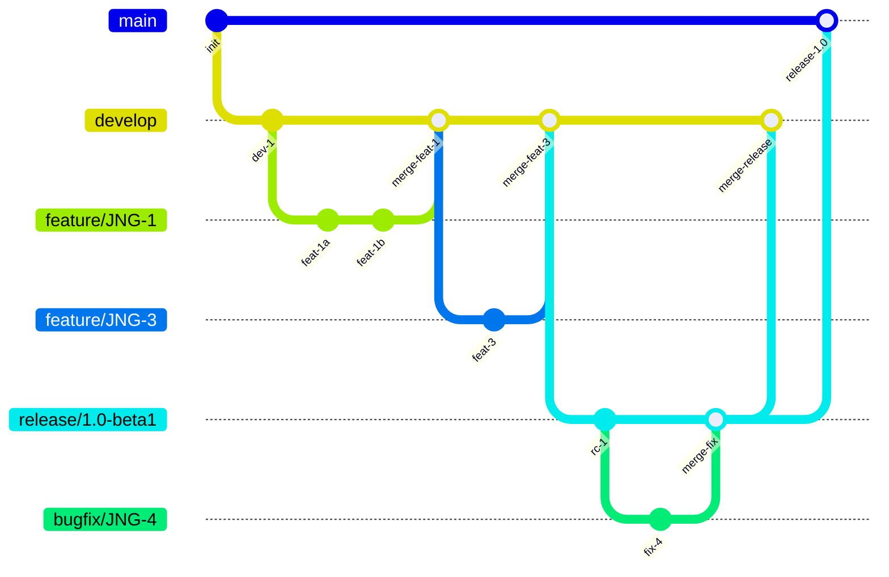
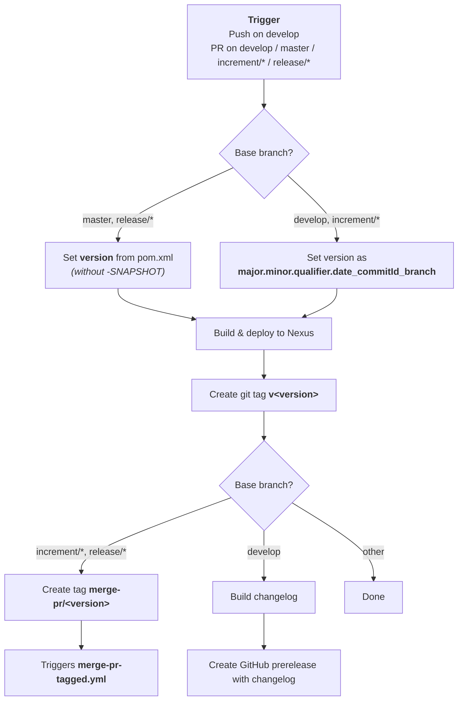
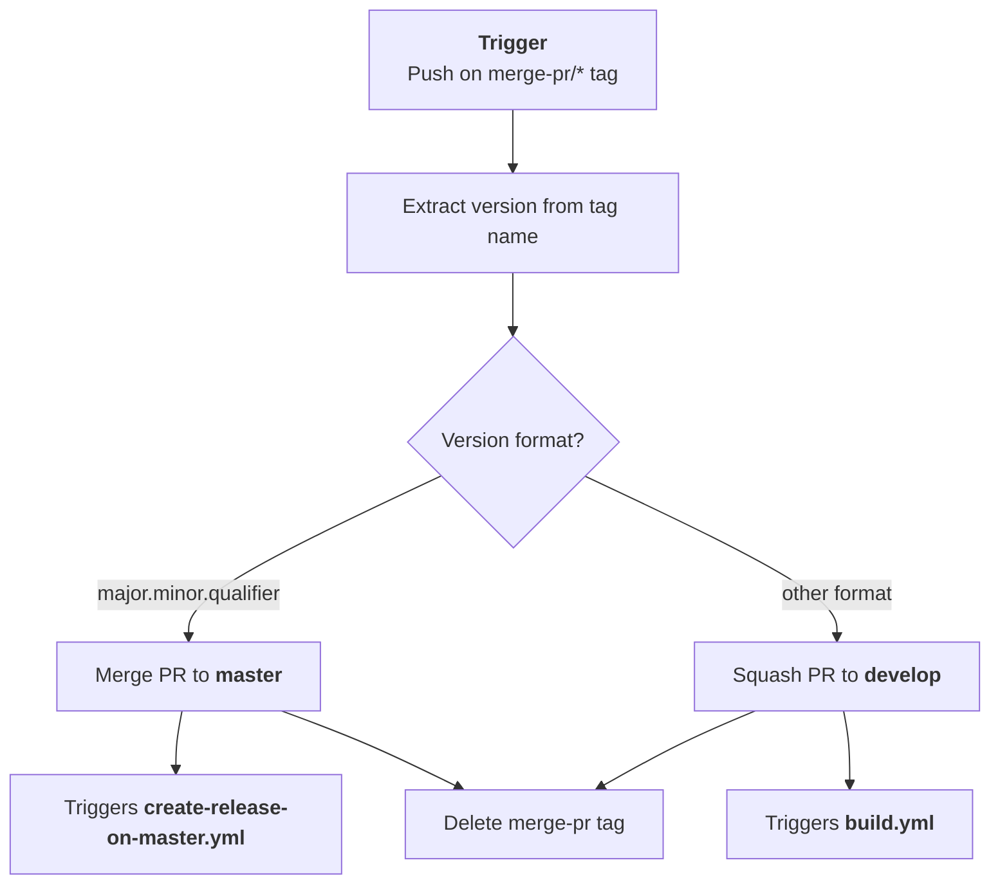
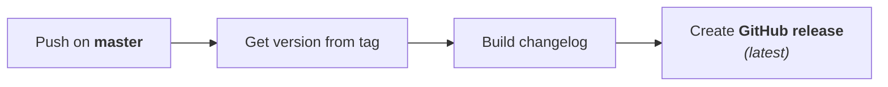
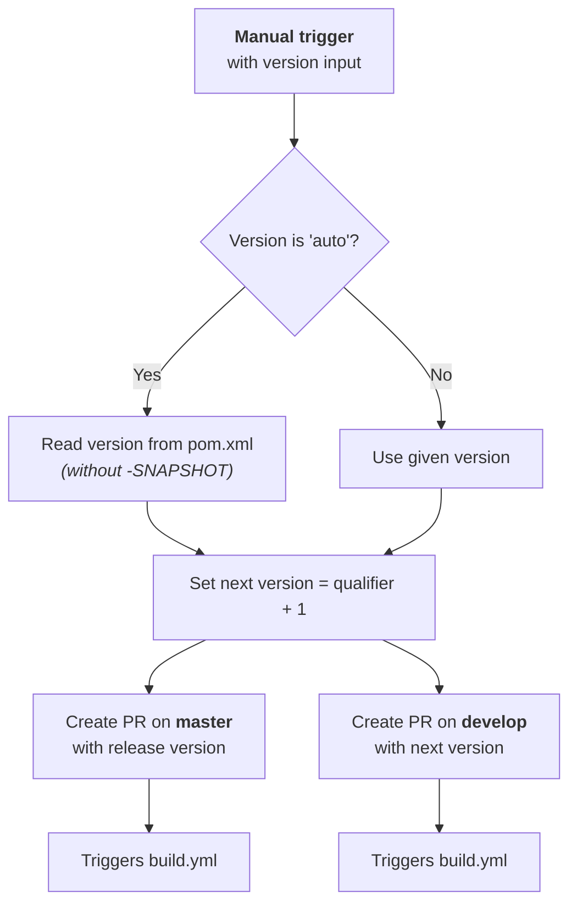
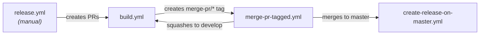

# Development Version and Branch Handling

This document describes the branching strategy, version numbering, and CI/CD pipeline for judo-requirement-report. The project follows a GitFlow-based workflow with automated GitHub Actions for building, testing, and releasing.

## Table of Contents

- [Branches](#branches)
- [Version Numbers](#version-numbers)
- [GitHub Actions Workflows](#github-actions-workflows)
  - [build.yml](#buildyml)
  - [merge-pr-tagged.yml](#merge-pr-taggedyml)
  - [create-release-on-master.yml](#create-release-on-masteryml)
  - [release.yml](#releaseyml)
- [How to Develop](#how-to-develop)

## Branches

The versioning policy is based on [GitFlow](https://www.atlassian.com/git/tutorials/comparing-workflows/gitflow-workflow).

| Branch Pattern | Base Branch | Purpose |
|---|---|---|
| `develop` | — | Main integration branch with latest development sources |
| `feature/JNG-xxx_summary` | `develop` | New features for the next release |
| `(release/)x.y.z` | `develop` | Release stabilization (`release/` prefix reserved for CI) |
| `bugfix/JNG-xxx_summary` | release branch | Bug fixes applied to release branches; must also be applied to newer versions |
| `support/JNG-xxx_summary` | release branch | Minor changes for previous releases; merged back to the release branch |
| `master` | — | Latest released sources |

### Branch Flow

## Version Numbers

Version numbers follow semantic versioning with these rules:

| Event | Version Change |
|---|---|
| Start a `feature/` branch | No change — inherits from `develop` |
| Start a `release/` branch | 2nd number in `develop` version is incremented |
| Start a `bugfix/` branch | No change — applied on release branches before merging to master |
| Start a `support/` branch | 3rd number is incremented; merged back to release branch without going to master |
| Start a `hotfix/` branch | 4th number is incremented; applied to both release and master branches |

## GitHub Actions Workflows

### build.yml

The main CI workflow, triggered on pushes to `develop` or pull requests targeting `develop`, `master`, `increment/*`, or `release/*` branches.

### merge-pr-tagged.yml

Triggered when a `merge-pr/*` tag is pushed. Handles automated merging of pull requests.

### create-release-on-master.yml

Triggered on pushes to `master`. Creates the official GitHub release.

### release.yml

Manually triggered workflow to initiate a release. Takes a version parameter (`'auto'` or a specific `major.minor.qualifier` version).

### Workflow Interaction Overview

## How to Develop

For issue tracking, the project uses [JIRA](https://blackbelt.atlassian.net/jira/dashboards).

> **Important:** There is no commit without a ticket number. Every pull request and commit must include a `JNG-xxx` reference.
