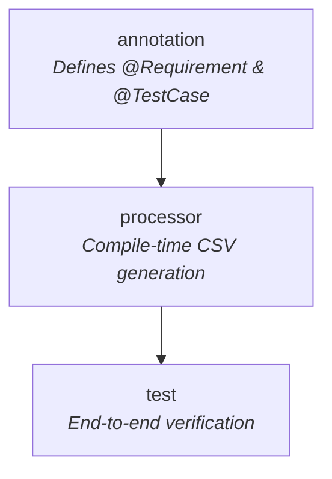
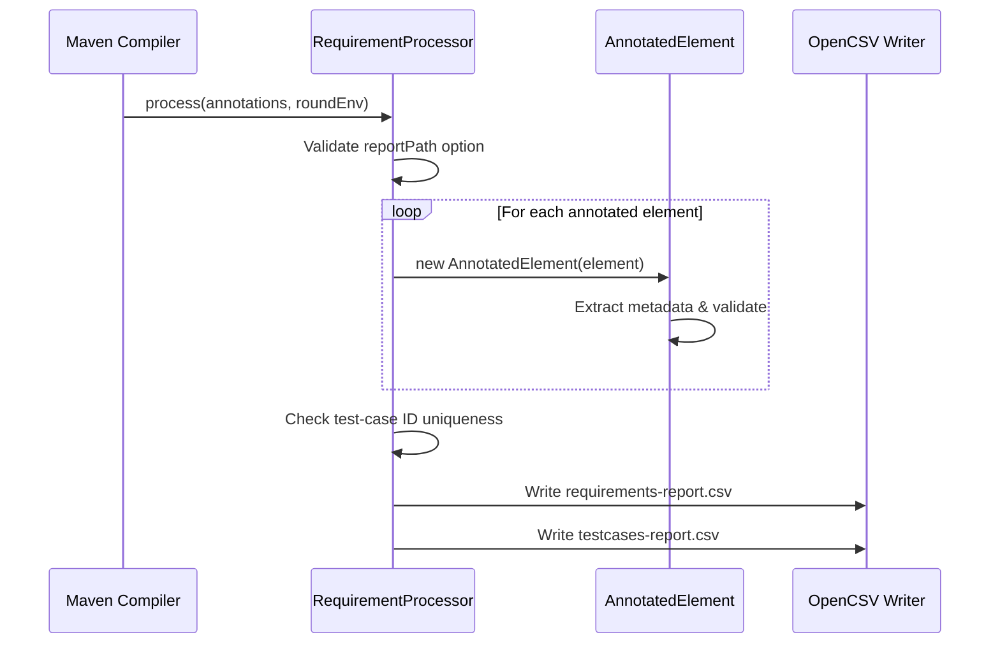
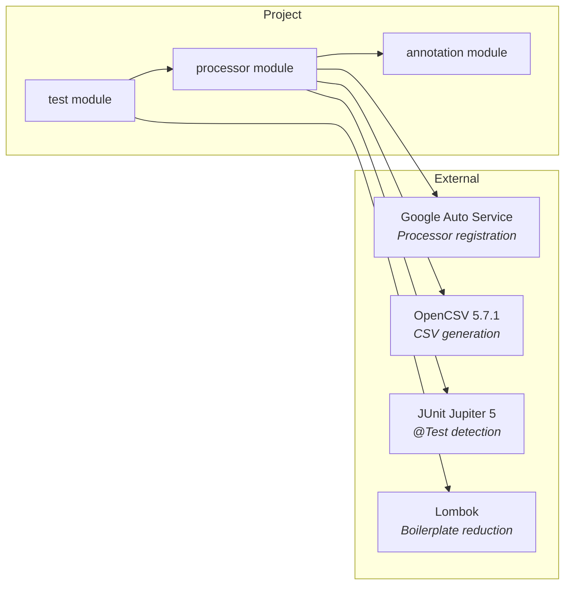

# judo-requirement-report

[](https://github.com/BlackBeltTechnology/judo-requirement-report/actions/workflows/build.yml)

## Introduction

**judo-requirement-report** is a Java compile-time annotation processor that extracts requirement and test-case metadata from annotated test methods and generates CSV traceability reports. It enables teams to automatically track which tests cover which requirements, producing machine-readable output without any runtime overhead.

This project is a building block of the [judo-community](https://github.com/BlackBeltTechnology/judo-community) aggregator project. See the judo-community documentation for how this module fits into the broader ecosystem.

## How It Works

Developers annotate their JUnit 5 test methods with `@Requirement` (linking to one or more requirement IDs) and `@TestCase` (assigning a unique test-case identifier). During compilation, the annotation processor discovers these annotations, validates them, and writes two semicolon-separated CSV reports:

| Report File | Columns | Purpose |
|---|---|---|
| `requirements-report.csv` | TEST METHOD, TEST CASE ID, STATUS, REQUIREMENT | Maps each test method to the requirements it covers |
| `testcases-report.csv` | TEST CASE ID, TEST METHOD, STATUS | Lists all test cases with their validation status |

The processor also validates annotation usage and flags issues such as missing `@Test` annotations, empty requirement arrays, duplicate test-case IDs, and missing `@TestCase` annotations.

## Module Structure



| Module | Description |
|---|---|
| `judo-requirement-report-annotation` | Defines `@Requirement(reqs={...})` and `@TestCase("...")` annotations with `SOURCE` retention |
| `judo-requirement-report-processor` | The annotation processor itself — discovers annotated elements, validates them, and writes CSV reports via OpenCSV |
| `judo-requirement-report-test` | End-to-end tests — annotated methods serve as processor input; JUnit tests verify the generated CSV output |

## Quick Start

### Prerequisites

- Java 21 JDK
- Maven 3.9.4+

### Build & Test

```sh
# Full build (compile + test + install to local repo)
./mvnw clean install

# Run tests only
./mvnw clean test
```

### Using the Annotations

Add the annotation dependency to your project:

```xml
<dependency>
    <groupId>hu.blackbelt.judo</groupId>
    <artifactId>judo-requirement-report-annotation</artifactId>
    <version>${judo-requirement-report.version}</version>
</dependency>
```

Add the processor dependency and configure the compiler plugin:

```xml
<dependency>
    <groupId>hu.blackbelt.judo</groupId>
    <artifactId>judo-requirement-report-processor</artifactId>
    <version>${judo-requirement-report.version}</version>
</dependency>
```

```xml
<plugin>
    <groupId>org.apache.maven.plugins</groupId>
    <artifactId>maven-compiler-plugin</artifactId>
    <configuration>
        <compilerArgs>
            <arg>-AreportPath=${project.basedir}/target/classes</arg>
        </compilerArgs>
    </configuration>
</plugin>
```

Then annotate your test methods:

```java
@Requirement(reqs = {"REQ-001", "REQ-002"})
@TestCase("TC-001")
@Test
public void testUserCanLogin() {
    // ...
}
```

## Annotation Processing Flow



## Key Dependencies



## Contributing

See [CONTRIBUTING.md](CONTRIBUTING.md) for development setup, submission guidelines, and available commands.

## License

This project is licensed under the [Eclipse Public License - v 2.0](https://www.eclipse.org/legal/epl-2.0/).
